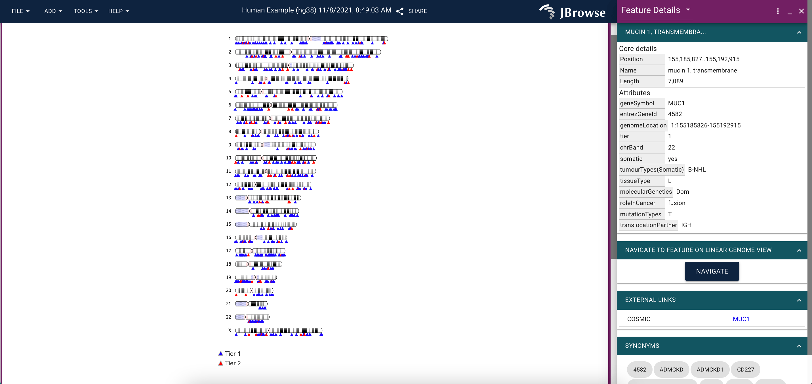

# `jbrowse-plugin-ideogram`

> Jbrowse 2 plugin for displaying an ideogram

## Screenshot



### Note

Uses the great https://eweitz.github.io/ideogram/ library for rendering

## Usage

### In [JBrowse Web](https://jbrowse.org/jb2/docs/quickstart_web)

#### Development

```
git clone https://github.com/cmdcolin/jbrowse-plugin-ideogram
cd jbrowse-plugin-ideogram
yarn
yarn start
```

Then open JBrowse Web to (assuming it is running on port 3000):

http://localhost:3000/?config=http://localhost:9000/config.json

#### Demo

> coming soon

#### Production

Add to the "plugins" of your JBrowse Web config:

```json
{
  "plugins": [
    {
      "name": "Ideogram",
      "url": "https://unpkg.com/jbrowse-plugin-ideogram/dist/jbrowse-plugin-ideogram.umd.production.min.js"
    }
  ]
}
```

## Annotations

To annotate features on the ideogram as in the screenshot above, data must be uploaded via the setup screen's open file interface.

- annotations must be uploaded as a TSV with column headers
- location data must be under a heading called 'genome location' and be in the format of 'chromosomeNumber:start-end', e.g. '1:39895426-39902013'
- each row of data must include `name` and `genomeLocation`
- any external links that wish to be formatted on the widget properly must be in the following format:'
  - under a header 'external links'
  - a json string appearing as `"[{"name": "MYLINK", "link": "https://my-link.com/"}]"`
  - each annotation that you wish to have external links to must have this json string
  - multiple external links are permitted
- annotations can be categorized into two categories if the 'tier' header is within the TSV
  - tier 1 is annotated in blue
  - tier 2 is annotated in red
  - this field is to be provided as a 1 or a 2

### examples

#### TSV with only required headers

```tsv
name  genomeLocation
note1 1:39895426-39902013
note2 1:157573749-157598080
```

#### TSV with optional headers

```tsv
name  genomeLocation  tier externalLinks
note1 1:39895426-39902013 1 [{"name":"MYLINK","link":"https://my-link.com/note1"}]
note2 1:157573749-157598080 2 [{"name":"MYLINK", "link":"https://my-link.com/note2"}]
```

Any additional data will be parsed out and displayed in the widget that can be brought out by clicking an annotation on the ideogram.

If these formatting rules are not obeyed the annotations will not be displayed.
