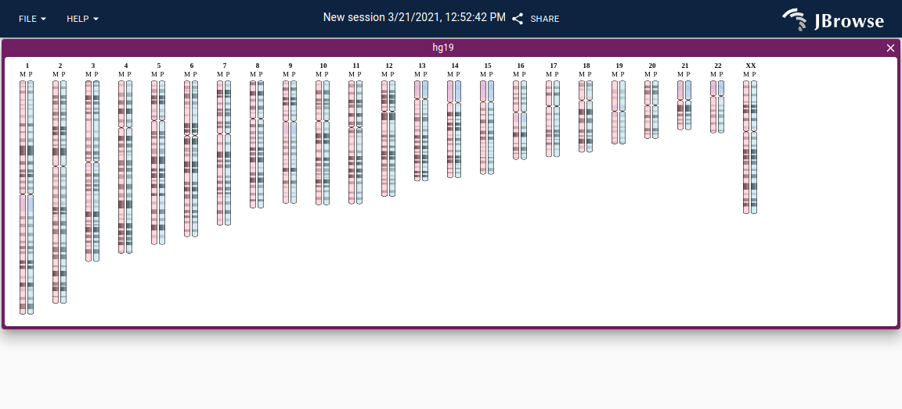

# jbrowse-plugin-ideogram

This is a demo for showing an ideogram inside of jbrowse 2

## Screenshot

Showing diploid human genome

## Note

Uses the great https://eweitz.github.io/ideogram/ library for rendering
